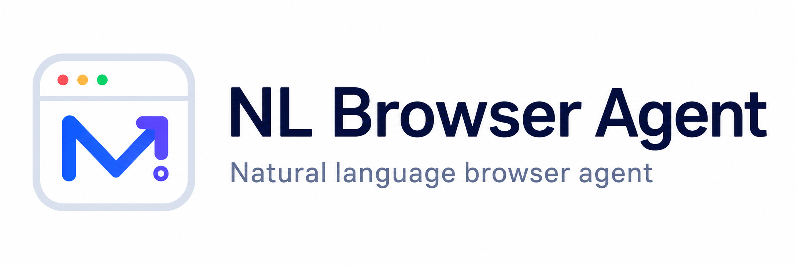

  

  <a href="https://youtu.be/nZJBhx9oFNA">▶ Watch the introduction animation</a>

**English** | [中文](#中文)

A Chrome and Microsoft Edge extension that lets you control your browser with natural language — inspired by Claude in Chrome.

> **You need your own API key.** This extension doesn't provide AI itself — you sign up with a model provider (e.g. DeepSeek, OpenAI), get an API key from them (usually pay-as-you-go), and paste it into the extension's Settings page. The extension is free; the model calls are billed by the provider to your own account.

Type one sentence in the side panel; the AI looks at the page (screenshot + numbered interactive elements), decides the next step, and executes it — click, type, scroll, navigate — until the task is done.

## Features

- **Provider presets** — built-in presets for DeepSeek, Kimi (Moonshot), Qwen and OpenAI, plus a custom option for any OpenAI-compatible endpoint. Requires an API key you obtain yourself from that provider. The key is stored locally in `chrome.storage` and never leaves your machine except to call the API you configured.
- **Vision** — sends page screenshots to the model so it can read canvas-based pages (Google Docs, embedded images, exam questions…). Requires a vision-capable model such as GPT-4o or Qwen-VL.
- **Trusted input** — uses `chrome.debugger` (CDP) to send real mouse/keyboard events, so it can operate apps that ignore synthetic events, like Google Docs.
- **Multi-tab tasks** — lists and switches between existing tabs, automatically follows links that open a new tab, and can keep operating a background tab when trusted input is enabled.
- **Stable coordinates** — refreshes an element's position immediately before clicking and remaps screenshot coordinates if the viewport or page zoom changes.
- **Reliable Docs editing** — the model only proposes a find/replace pattern; deterministic code drives the Google Docs Find-and-Replace dialog (open, toggle regex, fill, replace all). Calibrated against the real Docs DOM.
- **Floating window** — pop the panel out of the side panel onto the page itself; drag to move, resize from the corner.
- **Themes** — customize background, surface, text, border, accent and the glow color shown around the page while a task runs.
- **7 languages** — UI, action log and model replies in 简体中文 / English / 日本語 / 한국어 / Español / Français / Deutsch. A language picker appears on first launch; change anytime in Settings.
- **Session chat history** — survives switching between side panel and floating window; cleared when the browser closes.

## Install

1. Open `chrome://extensions` (Chrome) or `edge://extensions` (Edge), then enable **Developer mode**
2. Click **Load unpacked** and select this folder
3. Click the extension icon to open the side panel, and pick your language
4. Open Settings, choose a provider, paste your API key, click **Test connection**
5. Optionally enable **Vision** (needs a vision model) and **Trusted input (debugger)** — required for editing Google Docs
6. Switch to a normal web page, type a task, hit **Run**

If Edge doesn't automatically restore the sidebar after switching tabs, click the extension icon or press `Ctrl+Shift+Y` (`Cmd+Shift+Y` on macOS).

> While a task runs, the browser shows an *"is debugging this browser"* bar — that's the trusted-input mode and it's normal; it disconnects when the task ends. Don't open DevTools (F12) on the same tab at the same time.

## Examples

- "Search Bing for tomorrow's weather in Shanghai and tell me"
- "Fill this form: name Zhang San, email xxx, then submit"
- "Delete the brackets and numbers after every heading in this doc"
- "Add a Chinese gloss after each of these words, based on the passage above"

## Project layout

| Path | What it does |
|------|--------------|
| `manifest.json` | MV3 manifest |
| `background.js` | Opens the side panel; side-panel close workaround |
| `panel.html/js/css` | Chat UI (side panel & floating window) |
| `options.html/js` | Settings: provider / theme / language |
| `lib/agent.js` | Agent loop: observe → think → act; tool definitions |
| `lib/page.js` | Injected functions: page snapshot, actions, find-replace driver, glow, floating window |
| `lib/cdp.js` | Trusted input via `chrome.debugger` (CDP) |
| `lib/providers.js` | Provider presets + OpenAI-compatible chat API |
| `lib/theme.js` | Theme storage and CSS variables |
| `lib/i18n.js` | 7-language dictionaries |

## Known limitations

- Cannot operate browser-internal pages (`chrome://…`, `edge://…`) or browser extension stores
- Background-tab screenshots and actions require **Trusted input (debugger)**; without it, the target tab is brought to the foreground
- New tabs in the same browser window are followed automatically; separate popup windows are not yet followed

## License

[MIT](LICENSE)

---

# 中文

用自然语言操作浏览器的 Chrome 与 Microsoft Edge 扩展，灵感来自 Claude in Chrome。

**[▶ 观看英文简介动画](https://youtu.be/nZJBhx9oFNA)**

> **需要你自己准备 API Key。** 这个扩展本身不提供 AI 能力——你要去某个模型服务商（如 DeepSeek、OpenAI）注册账号、申请一个 API Key（通常按用量付费），然后填进扩展的设置页。扩展本身免费，调用模型的费用由服务商直接从你自己的账户扣。

在侧边栏输入一句话，AI 会**看**页面（截图 + 编号的可交互元素）、**想**下一步、**做**出点击/输入/滚动/跳转，一步步完成任务。

## 功能

- **多服务商模板** —— 内置 DeepSeek、Kimi (Moonshot)、通义千问、OpenAI 模板，也可自定义任意 OpenAI 兼容接口。需要你自己在对应服务商申请 API Key。Key 只存本机 `chrome.storage`，除了调用你配置的 API 不会发往任何地方。
- **视觉** —— 把网页截图发给模型，能读懂 Google Docs 等 canvas 页面、文档里嵌的图片和题目。需要带视觉的模型（GPT-4o、通义-VL 等）。
- **真实按键** —— 通过 `chrome.debugger`（CDP）发送受信任的键鼠事件，能操作 Google Docs 这类不认合成事件的应用。
- **多标签页任务** —— 可列出和切换已有标签页，自动跟随链接新开的标签页；开启真实按键后还能继续操作后台标签页。
- **稳定坐标** —— 点击前重新读取元素实时位置；页面缩放或视口变化后会自动重新映射截图坐标。
- **可靠的 Docs 编辑** —— 模型只出查找/替换模式，由确定性代码驱动 Docs 的查找替换对话框（打开、勾正则、填框、全部替换），对照真实 DOM 校准。
- **浮窗模式** —— 把面板弹到网页上，可拖动、可缩放。
- **主题** —— 背景、表面、文字、边框、强调色、运行光效颜色全部可调。
- **7 种语言** —— 界面、动作日志、模型回复支持简中/英/日/韩/西/法/德，首次启动选择，设置里随时可改。
- **会话级聊天记录** —— 侧边栏 ↔ 浮窗切换不丢，关浏览器自动清空。

## 安装

1. Chrome 打开 `chrome://extensions`，Edge 打开 `edge://extensions`，然后开启**开发者模式**
2. 点**加载已解压的扩展程序**，选择本文件夹
3. 点工具栏扩展图标打开侧边栏，选择语言
4. 进设置：选服务商 → 填 API Key → 点**测试连接**
5. 按需打开**视觉**（需视觉模型）和**真实按键（debugger）**——编辑 Google Docs 必须开
6. 切到普通网页，输入任务，点**运行**

如果 Edge 切换标签后没有自动恢复侧栏，请点击扩展图标，或按 `Ctrl+Shift+Y`（macOS 为 `Cmd+Shift+Y`）重新打开。

> 任务运行时浏览器顶部会出现"正在调试此浏览器"提示条，这是真实按键模式的正常现象，任务结束自动断开。同一标签页不要同时开 DevTools（F12）。

## 示例

- "在必应搜索明天上海的天气并告诉我结果"
- "把这个表单里的姓名填成张三，邮箱填 xxx，然后提交"
- "帮我把文档里每个小标题后面的括号和数字删掉"
- "根据上面的文章，给这几个单词加上中文释义"

## 已知限制

- 不能操作 `chrome://`、`edge://` 等浏览器内部页和浏览器扩展商店
- 后台标签页截图和操作需要开启**真实按键（debugger）**；未开启时会自动把目标标签页切到前台
- 同一浏览器窗口内新开的标签页会自动跟随，独立弹窗窗口暂不跟随

## 协议

[MIT](LICENSE)
